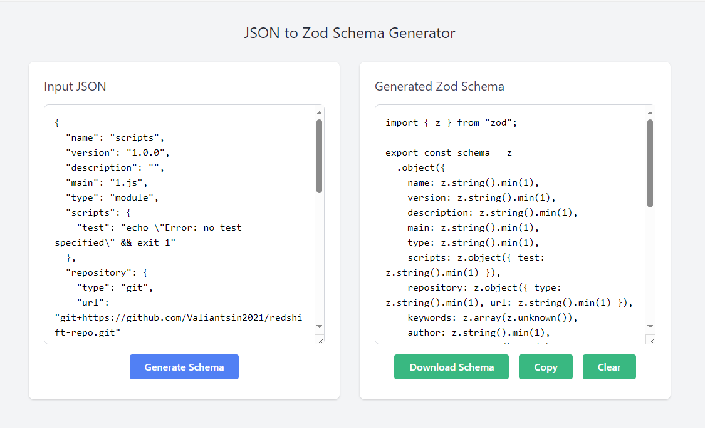

# ZOD Schema Generator for API JSON Responses
=============================================

A standalone HTML page for generating ZOD schemas from API JSON responses.

See it live: [https://valiantsin2021.github.io/schema-generator/](https://valiantsin2021.github.io/schema-generator/)

## Overview

This project provides a simple and intuitive way to generate ZOD schemas from API JSON responses. With this tool, you can easily create schemas for your API responses, making it easier to validate and document your API.

## Features

* Generate ZOD schemas from API JSON responses
* Supports multiple schema formats (e.g. JSON, YAML)
* Easy-to-use interface for customizing schema generation

## Usage

1. Open the `index.html` file in your web browser.
2. Enter the API JSON response you want to generate a schema for.
3. Customize the schema generation options as needed.
4. Click the "Generate Schema" button to generate the ZOD schema.

## Example Use Case

Suppose you have an API that returns the following JSON response:
```json
{
  "name": "John Doe",
  "age": 30,
  " occupation": "Software Engineer"
}
```
Using this tool, you can generate a ZOD schema for this response:
```javascript
import { z } from 'zod';

const userSchema = z.object({
  name: z.string(),
  age: z.number(),
  occupation: z.string()
});
```
## Screenshot

Here's a screenshot of the tool in action:



## Try it out!

You can try out the ZOD Schema Generator by visiting the [live demo page](https://valiantsin2021.github.io/schema-generator/).

## Contributing

Contributions are welcome! If you have any ideas for new features or improvements, please open an issue or submit a pull request.

## License

This project is licensed under the MIT License. See the `LICENSE` file for details.

## Acknowledgments

This project was built using the following dependencies:

* ZOD: A TypeScript-first schema validation library.
* HTML/CSS/JS: For building the standalone HTML page.

Note: Replace `screenshot.png` with the actual screenshot file, and `https://example.com/zod-schema-generator` with the actual live demo page URL.
